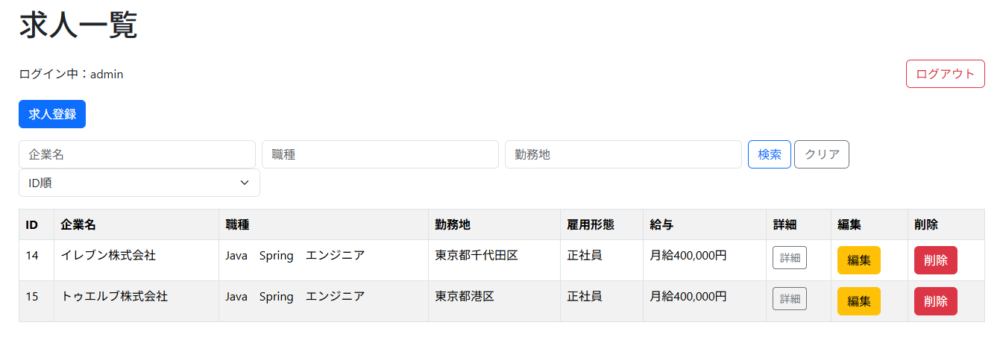
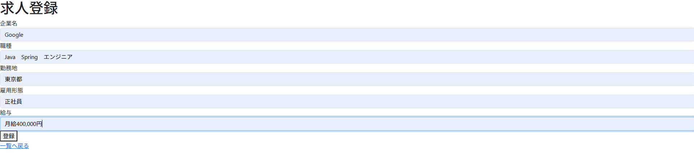
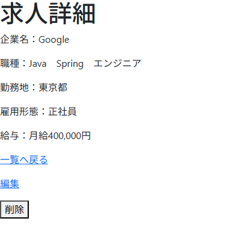
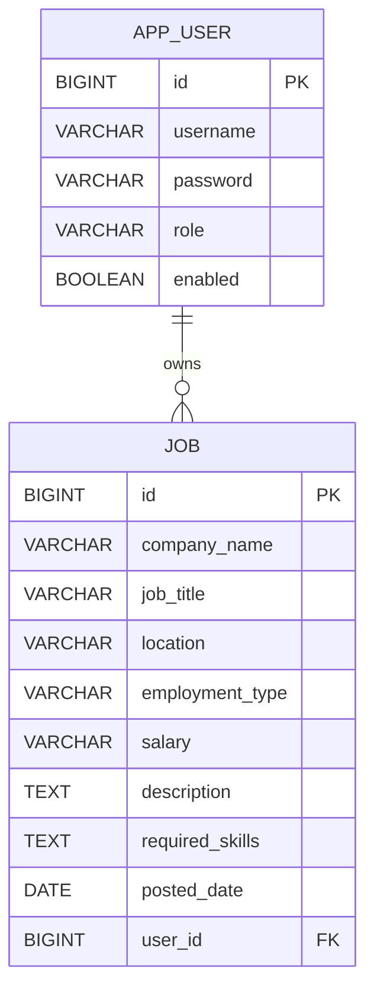
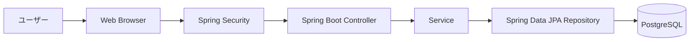

# JobManager

求人管理システム（Spring Boot + PostgreSQL）

## 概要

求職者支援訓練向けの求人管理システムです。  
求人情報の登録・検索・編集・削除を行えます。

## 使用技術

- Java 21
- Spring Boot
- Spring Data JPA
- PostgreSQL
- Thymeleaf
- Bootstrap
- Git / GitHub

## 主な機能

- 求人一覧表示
- 求人詳細表示
- 求人登録
- 求人編集
- 求人削除
- バリデーション
- 企業名・職種・勤務地による複合検索
- ユーザー登録
- ログイン / ログアウト
- ログインユーザーごとの求人管理
- 他ユーザー求人へのアクセス制限

## 画面イメージ

### 求人一覧



### 求人登録



### 求人詳細



### 求人検索


## ER図



## システム構成図



## Docker起動方法

### 起動

```bash
docker compose up --build
```

### アクセスURL

```text
http://localhost:8080/login
```

### 初期ユーザー

```text
ユーザー名：admin
パスワード：password
```

### Docker版で確認できること

- ユーザー登録
- ログイン / ログアウト
- 求人登録
- 求人一覧表示
- 求人検索
- 求人編集
- 求人削除
- PostgreSQLコンテナへのデータ保存

### 停止

```bash
docker compose down
```
